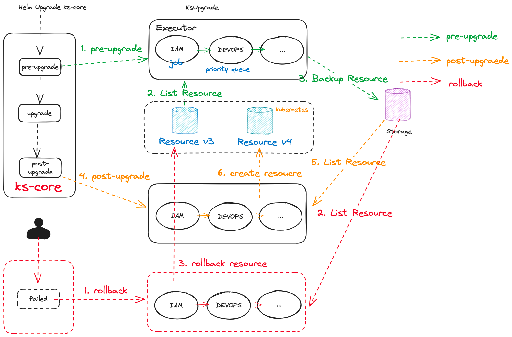

<!-- TOC -->
      * [ks-upgrade](#ks-upgrade)
      * [1. Workflow](#1-workflow)
      * [2. Quick Start](#2-quick-start)
        * [2.1 Create plugin demo](#21-create-plugin-demo)
        * [2.2 How to register Kubernetes resource scheme](#22-how-to-register-kubernetes-resource-scheme)
        * [2.3 Query/update/delete Kubernetes resource](#23-queryupdatedelete-kubernetes-resource)
        * [2.4 Load/save backup resource](#24-loadsave-backup-resource)
        * [2.5 How to create installplan](#25-how-to-create-installplan)
        * [2.6 Debug pre-upgrade/post-upgrade](#26-debug-pre-upgradepost-upgrade)
      * [3. Config](#3-config)
        * [3.1 Storage](#31-storage)
          * [3.1.1 FileLocalStorage](#311-filelocalstorage)
          * [3.1.2 S3Storage](#312-s3storage)
        * [3.2 Executor](#32-executor)
<!-- TOC -->
#### ks-upgrade

#### 1. Workflow




#### 2. Quick Start

##### 2.1 Create plugin demo
1. Create plugin workspace
    ```shell
    mkdir -p pkg/jobs/plugin
    ```
2. Create pkg/jobs/plugin/plugin.go
    ```shell
    const jobName = "plugin"
    
    var _ executor.UpgradeJob = &upgradeJob{}
    
    type factory struct {}
    
    func (f *factory) Name() string {
        return jobName
    }
    
    func (f *factory) Create(_ *executor.DynamicOptions, _ *model.ExtensionRef) (executor.UpgradeJob, error) {
        return &upgradeJob{}, nil
    }
    
    type upgradeJob struct {
        clientV3      runtimeclient.Client
        clientV4      runtimeclient.Client
        resourceStore store.ResourceStore
    }
    
    func (i *upgradeJob) PreUpgrade(ctx context.Context) error {
    }
    
    func (i *upgradeJob) PostUpgrade(ctx context.Context) error {
    }
    ```
3. Register plugin job
    ```shell
    # pkg/jobs/plugin/plugin.go
    func init() {
        runtime.Must(executor.Register(&factory{}))
    }
    
    # pkg/jobs/register.go
    import _ "kubesphere.io/ks-upgrade/pkg/jobs/plugin"
    ```
4. Inject KubeSphere v3/v4 client
    ```shell
    # pkg/jobs/plugin/plugin.go
    var _ executor.InjectClientV3 = &upgradeJob{}
    var _ executor.InjectClientV4 = &upgradeJob{}
    
    func (i *upgradeJob) InjectClientV3(client runtimeclient.Client) {
        i.clientV3 = client
    }
    
    func (i *upgradeJob) InjectClientV4(client runtimeclient.Client) {
        i.clientV4 = client
    }
    ```
5. Inject Kubernetes resource store
    ```shell
    # pkg/jobs/plugin/plugin.go
    var _ executor.InjectResourceStore = &upgradeJob{}
    
    func (i *upgradeJob) InjectResourceStore(store store.ResourceStore) {
        i.resourceStore = store
    }
    ```
##### 2.2 How to register Kubernetes resource scheme
1. Create new scheme
    ```shell
    # create new scheme under v3/api or v4/api
    v3
    ├── api
    │   ├── CONTRIBUTING.md
    │   ├── LICENSE
    │   ├── OWNERS
    │   ├── README.md
    │   ├── alerting
    │   ├── application
    │   ├── auditing
    │   ├── cluster
    │   ├── constants
    │   ├── devops
    │   ├── gateway
    │   ├── iam
    │   ├── network
    │   ├── notification
    │   ├── quota
    │   ├── servicemesh
    │   ├── storage
    │   ├── tenant
    │   └── types
    └── scheme
        └── scheme.go
    ```
    ```shell
    v4
    ├── api
    │   ├── CONTRIBUTING.md
    │   ├── LICENSE
    │   ├── OWNERS
    │   ├── README.md
    │   ├── application
    │   ├── cluster
    │   ├── constants
    │   ├── core
    │   ├── extensions
    │   ├── gateway
    │   ├── iam
    │   ├── marketplace
    │   ├── oauth
    │   ├── quota
    │   ├── storage
    │   ├── telemetry
    │   └── tenant
    └── scheme
        └── scheme.go
    ```
2. Register scheme
    ```shell
    # v3/scheme/scheme.go
    # v4/scheme/scheme.go
    
    func AddToScheme(scheme *runtime.Scheme) error {
        var SchemeBuilder = runtime.SchemeBuilder{
            ${Resource}.AddToScheme,   # <----- 注册对应资源的scheme
        }
        return SchemeBuilder.AddToScheme(scheme)
    }
    ```
##### 2.3 Query/update/delete Kubernetes resource
```go
package plugin

func (i *upgradeJob) PreUpgrade(ctx context.Context) error {
    // pkg/jobs/plugin/plugin.go
    obj := iamv1alpha2.UserList{}
    // clientV3 or clientV4
    if err := i.clientV3.List(ctx, &obj, &runtimeclient.ListOptions{}); err != nil {
        return nil
    }
    return nil
}
```
##### 2.4 Load/save backup resource
```go
package plugin

const jobName = "iam"

func (i *upgradeJob) PreUpgrade(ctx context.Context) error {
   // pkg/jobs/plugin/plugin.go   
   // 1. check if the backup data is already existed
   obj := iamv1alpha2.UserList{}
   key := fmt.Sprintf("%s-%s", jobName, "users.iam.kubesphere.io.v1alpha2")
   err := i.resourceStore.Load(key, &obj) // <----- load resource form store

   if err != nil && errors.Is(err, storage.BackupKeyNotFound) {
      if err := i.clientV3.List(ctx, &obj, &runtimeclient.ListOptions{}); err != nil {
         return err
      }
      // backup resource with restore
      if err := i.resourceStore.Save(key, &obj); err != nil {
         return err
      }
   }

   // logic to clean unused resource or other action before upgrade
   return nil
}

func (i *upgradeJob) PostUpgrade(ctx context.Context) error {
   cm := v1.ConfigMap{}
   key := fmt.Sprintf("%s-%s", jobName, "plugin-config")
   err := i.resourceStore.Load(key, &cm)
   if err != nil {
      return err
   }

   // create plugin installplan with old configmap from store
   installplan := corev1alpha1.InstallPlan{}  // <----- filling with old config
   if err := i.clientV4.Create(ctx, &installplan , &runtimeclient.CreateOptions{}); err != nil {
	   return err
   }
   
   

   obj := iamv1alpha2.UserList{}
   key = fmt.Sprintf("%s-%s", jobName, "users.iam.kubesphere.io.v1alpha2")
   // load resource from restore
   err = i.resourceStore.Load(key, &obj)
   if err != nil {
      return err
   }

   // upgrade crd with old crd fields
   for _, item := range obj.Items {
      klog.Infof("restore: %v", item)
   }
   return nil
}
```
##### 2.5 How to create installplan
1. Create configmaps with helm-charts
   ```shell
   helm pull repo/sample-extension
   kubectl create cm sample-extension-0.0.1 --from-file=charts=sample-extension-0.0.1.tgz
   ```
2. Create extensions version
   ```yaml
   apiVersion: kubesphere.io/v1alpha1
   kind: ExtensionVersion
   metadata:
     name: sample-extension-0.0.1   # ExtensionVersion <extension-name>-<extension-version>
   spec:
     chartDataRef:
       key: charts                  # configmap key of helm-charts
       name: sample-extension-0.0.1 # configmap name of helm-charts
       namespace: default           # configmap namespaces
     installationMode: HostOnly     # HostOnly or Multicluster
     version: 0.0.1                 # Extension version
   ```
3. Create installplan for extension
   ```yaml
   apiVersion: kubesphere.io/v1alpha1
   kind: InstallPlan
   metadata:
     name: sample-extension
   spec:
     enabled: true               # Enable/Disable install
     extension:
       name: sample-extension    # ExtensionVersion extension-name
       version: 0.0.1            # ExtensionVersion extension-version
     upgradeStrategy: Automatic  # Automatic or Manual
   ```
##### 2.6 Debug pre-upgrade/post-upgrade
1. Create config
    ```yaml
    # config.yaml
    storage:
      local:
        path: ./bin/
    jobs:
      iam:
        disabled: false
        priority: 10
        extensionRef:
          name: ""
          version: ""
          namespace: ""
          chartsPath: ""
        dynamicOptions:
          k: "v"
    ```
2. Run
    ```shell
    go run cmd/ks-upgrade.go --config=config.yaml
    
    go run cmd/ks-upgrade.go pre-upgrade --config=config.yaml
    
    go run cmd/ks-upgrade.go post-upgrade --config=config.yaml
    ```

#### 3. Config
##### 3.1 Storage
**Backend storage for backup kubernetes Resource.**
###### 3.1.1 FileLocalStorage
```yaml
# config.yaml
storage:
  local:
    path: /tmp/ks-upgrade  # <----- Default value
```
###### 3.1.2 S3Storage
```yaml
# config.yaml
storage:
  s3:
    endpoint: ip:port
    bucket: ks-upgrade
    region: wuhan
    disableSSL: true
    access_key_id: admin
    secret_access_key: P@88w0rd
```
##### 3.2 Executor
**Built-in priority queue for job already register**
```yaml
# config.yaml
jobs:
  iam:                 # <----- plugin name ==> func (f *factory) Name() string.
    disabled: false    # <----- enable/disable plugin job.
    priority: 10       # <----- The priority of the executor to execute the job.
    extensionRef:      # <----- extension config.
      name: ""         # <----- extension's name of charts.
      version: ""      # <----- extension's version of charts.
      namespace: ""    # <----- extension's namespace of charts installed. extension-<namespace>
      chartsPath: ""   # <----- extension's path of charts. 
      config: ""       
      clusterScheduling:
         placement:
            clusters:
               - host
            clusterSelector:
               matchLabels:
                  node-role.kubernetes.io/master: ""
               matchExpressions:
                  - key: kubernetes.io/arch
                    operator: In
                    values:
                       - amd64
         overrides:
            k: v
    dynamicOptions:    # <----- dynamicOptions for job to use custom parameters.
      key: value
  devops:
    disabled: false
    priority: 11
```